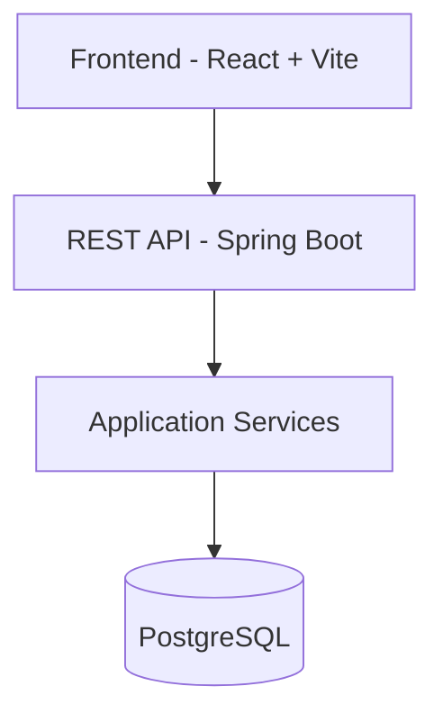

# RetailFlow SaaS POS Platform
Enterprise multi-tenant Point-of-Sale backend built with Java 21, Spring Boot, PostgreSQL, JWT authentication and role-based access control.  
Designed as a scalable SaaS-ready retail management platform with inventory tracking, sales processing and audit logging.


## Tech Stack
- Java 21+
- Spring Boot
- Spring Security + JWT
- Spring Data JPA / Hibernate
- PostgreSQL
- Docker Compose
- Swagger / OpenAPI
- Lombok
- Maven

## Features
### Authentication & Security
- JWT authentication
- BCrypt password hashing
- Role-based authorization (`OWNER` / `ADMIN` / `MANAGER` / `CASHIER`)
- Stateless API security

### Multi-Tenant Architecture
- Tenant isolation
- Tenant-specific products, sales and inventory
- Tenant-scoped RBAC

### Product Management
- Create / update / delete products
- SKU validation per tenant
- Soft delete support

### Inventory System
- Inventory movement tracking
- Stock adjustments
- Full audit trail
- Automatic stock reduction on sales

### Sales & Checkout
- Checkout workflow
- Multi-item sales
- Payment method support (`CASH`, `CARD`, `ONLINE`)
- Sale item snapshots
- Revenue tracking

### Reporting
- Revenue summary
- Sales count
- Low stock monitoring

## RBAC Matrix
| Feature | OWNER | ADMIN | MANAGER | CASHIER |
|---|---|---|---|---|
| Create Products | ✅ | ✅ | ❌ | ❌ |
| Update Products | ✅ | ✅ | ❌ | ❌ |
| Delete Products | ✅ | ✅ | ❌ | ❌ |
| Stock Adjustments | ✅ | ✅ | ✅ | ❌ |
| Checkout Sales | ✅ | ✅ | ✅ | ✅ |
| View Reports | ✅ | ✅ | ✅ | ❌ |

## API Documentation
Swagger UI is available at:  
`http://localhost:8085/swagger-ui/index.html`

> Optional: add a Swagger UI screenshot/banner in this repository (for example `docs/swagger-ui.png`) and reference it here.

## Architecture
The project follows a layered enterprise architecture:
- Controller Layer
- Service Layer
- Repository Layer
- DTO Mapping
- JWT Security Layer
- RBAC Authorization Layer

## Project Structure
```text
src/main/java/com/retailflow/backend
├── auth
├── common
├── config
├── inventory
├── product
├── report
├── sale
├── tenant
└── user
```

## Run Locally
### 1) Start PostgreSQL
```bash
docker compose up -d
```

### 2) Run backend
```bash
./mvnw spring-boot:run
```

## Run Full Stack with Docker
Start the complete platform with one command:

```bash
docker compose up --build
```

Services:

| Service | URL |
|---|---|
| Frontend | http://localhost:5173 |
| Backend API | http://localhost:8085 |
| Swagger UI | http://localhost:8085/swagger-ui/index.html |
| PostgreSQL | localhost:5433 |

To stop the stack:

```bash
docker compose down
```

## Deployment Readiness
The project includes Dockerized backend, frontend and PostgreSQL services with a production-style multi-stage build setup.

## Architecture Overview

```text
Frontend (React + Vite)
        ↓
REST API (Spring Boot)
        ↓
Service Layer
        ↓
PostgreSQL Database
```



## Application Screenshots

### Dashboard


### Products


### Inventory


### Sales


## Demo Walkthrough


> Replace the placeholder files in `docs/screenshots/` and `docs/demo/` with real captures from your running app.

## Example API Calls
### Login
```bash
curl -X POST "http://localhost:8085/api/auth/login" \
  -H "Content-Type: application/json" \
  -d '{
    "email": "owner@demo-store.com",
    "password": "Password123!"
  }'
```

### Create Product (OWNER/ADMIN)
```bash
curl -X POST "http://localhost:8085/api/products" \
  -H "Authorization: Bearer YOUR_TOKEN" \
  -H "Content-Type: application/json" \
  -d '{
    "name":"iPhone 15 Pro",
    "sku":"IPH-15-PRO",
    "description":"Demo phone",
    "price":1199.99,
    "stockQuantity":10
  }'
```

### Checkout
```bash
curl -X POST "http://localhost:8085/api/sales/checkout" \
  -H "Authorization: Bearer YOUR_TOKEN" \
  -H "Content-Type: application/json" \
  -d '{
    "paymentMethod":"CARD",
    "items":[
      {
        "productId":"PRODUCT_ID_HERE",
        "quantity":1
      }
    ]
  }'
```

## Demo Credentials (Local Development)
### OWNER
- email: `owner@demo-store.com`
- password: `Password123!`

### CASHIER
- email: `cashier@demo-store.com`
- password: `Password123!`

## GitHub Polish
- **Repository Description:** `Enterprise multi-tenant POS backend built with Spring Boot 3, JWT, PostgreSQL and Docker.`
- **Website field:** Swagger URL (`http://localhost:8085/swagger-ui/index.html`) or later frontend URL
- **Topics:** `spring-boot`, `java`, `jwt`, `postgresql`, `docker`, `saas`, `pos-system`, `enterprise-application`, `rest-api`, `hibernate`

## Future Improvements
- React frontend dashboard
- Redis caching
- Flyway database migrations
- CI/CD pipelines
- Kubernetes deployment
- Invoice PDF generation
- Stripe integration
- Automated integration testing

## Next Big Upgrade
Korak 29: React Admin Dashboard to evolve this backend into a full-stack enterprise SaaS platform.
